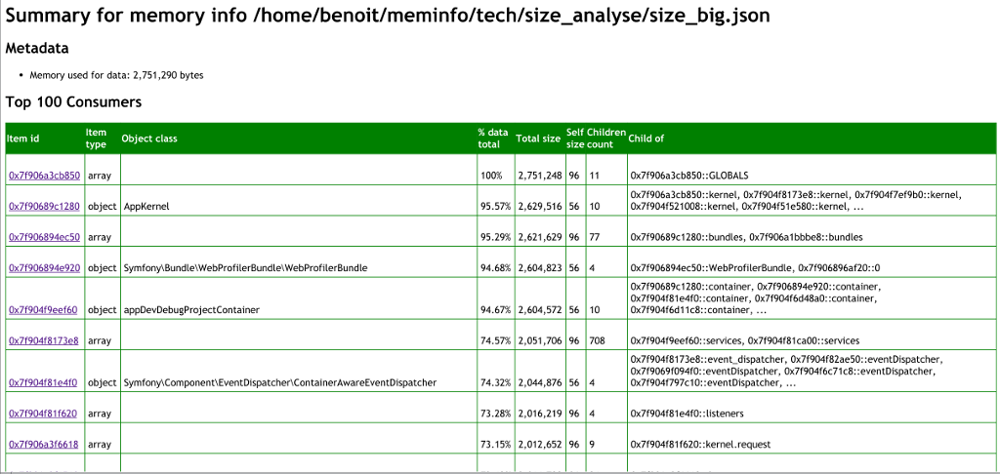
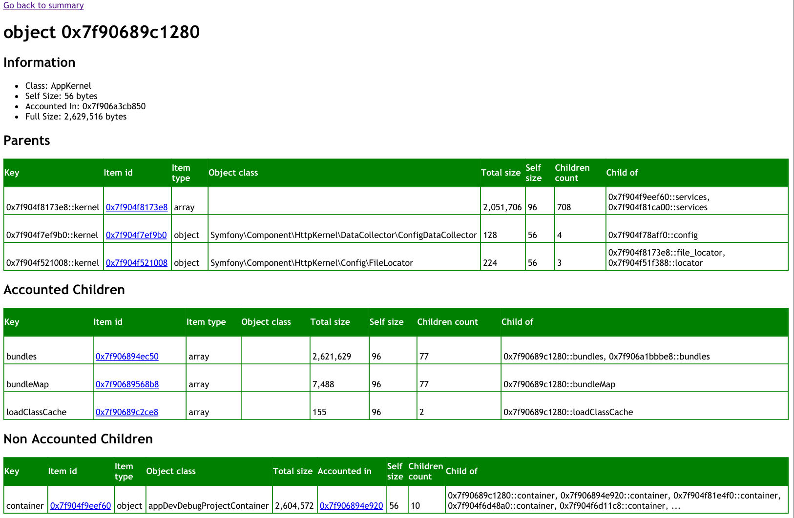

MEMINFO
=======
PHP Meminfo is a PHP extension that gives you insights on the PHP memory content.

Its main goal is to help you understand memory leaks, but by looking at data present in memory, you can better understand your application behaviour.

One of the main source of inspiration for this tool is the Java jmap tool with the -histo option (see `man jmap`).

Compatibility
-------------
Compiled and tested on:

 - PHP 5.4.4 (Debian 7)
 - PHP 5.5.8 (Ubuntu 12.04 LTS)
 - PHP 5.5.20 (CentOS 7)

Compilation instructions
------------------------
You will need the `phpize` command. It can be installed on a Debian based system by:
```bash
$ apt-get install php5-dev
```

Once you have this command, follow this steps:

## Compilation
From the root of the extension directory:

```bash
$ phpize
$ ./configure --enable-meminfo
$ make
$ make install
```

## Enabling the extension
Add the following line to your `php.ini`:

```ini
extension=meminfo.so
```

Usage
-----
All meminfo functions take a stream handle as a parameter. It allows you to specify a file, as well as to use standard output with the `php://stdout` stream.

## Exploring Memory usage
The provided user interface allows you to explore the content of your memory. It will show you the items instanciated, the dependencies between items and the size of each of them.

### Summary Screen
The main screen lists the top memory consumers, ordered by their total size.


### Item details Screen
Clicking on an item brings you to the Item Details Screen.


On this screen, you will see 5 parts:
 - title
Item type (object, array, string, boolean, etc...) and its pointer address in memory at the time of the data extraction.
This memory address is used as the unique identifier of the item

 - Information
Small summary on the item itself, like the class name in case of object and memory size information.

### How memory size is computed
See [the dedicated documentation](/doc/memory_calculation.md).

## Object instances count per class
Display the number of instances per class, ordered descending. Very useful to identify the content of a memory leak.

```php
    meminfo_objects_summary(fopen('php://stdout','w'));
```

The result will provide something similar to the following example (generated at the end of the Symfony2 console launch)

```
    Instances count by class:
    num          #instances   class
    -----------------------------------------------------------------
    1            181          Symfony\Component\Console\Input\InputOption
    2            88           Symfony\Component\Console\Input\InputDefinition
    3            77           ReflectionObject
    4            46           Symfony\Component\Console\Input\InputArgument
    5            2            Symfony\Bridge\Monolog\Logger
    6            1            Symfony\Component\EventDispatcher\ContainerAwareEventDispatcher
    7            1            Doctrine\Bundle\MigrationsBundle\Command\MigrationsDiffDoctrineCommand
    ...
```

Note: It's a good idea to call the `gc_collect_cycles()` function before executing  `meminfo_objects_summary()`, as it will collect dead objects that has not been reclaimed by the ref counter due to circular references. See http://www.php.net/manual/en/features.gc.php for more details.


### Examples
The `examples/` directory at the root of the repository contains more detailed examples.
```bash
    $ php examples/objects_summary.php
```


##List of currently active objects
Provides a list of live objects with their class and their handle, as well as the total number of active objects and the total number of allocated object buckets.

```php
    meminfo_objects_list(fopen('php://stdout','w'));
```

For example:

    Objects list:
      - Class MyClassB, handle 2, refCount 1
      - Class MyClassC, handle 5, refCount 1
      - Class MyClassC, handle 6, refCount 1
      - Class MyClassC, handle 7, refcount 1
    Total object buckets: 7. Current objects: 4.

Note: The same remark about `gc_collect_cycles()` before `meminfo_objects_summary()` applies as well for this function.

### Examples
The `examples/` directory at the root of the repository contains more detailed examples.

    php examples/objects_list.php

## Information on structs size
Display size in byte of main data structs size in PHP. Will mainly differ between 32bits et 64bits environments.

```php
    meminfo_structs_size(fopen('php://stdout','w'));
```

It can be useful to understand difference in memory usage between two platforms.

Example Output on 64bits environment:

```
    Structs size on this platform:
      Class (zend_class_entry): 568 bytes.
      Object (zend_object): 32 bytes.
      Variable (zval): 24 bytes.
      Variable value (zvalue_value): 16 bytes.
```

Usage in production
-------------------
PHP Meminfo can be used in production, as it does not have any impact on performances outside of the call to the `meminfo` functions.

Nevertheless, production environment is not where you debug ;)

Other memory debugging tools for PHP
-------------------------------------
 - XDebug (http://www.xdebug.net)
With the trace feature and the memory delta option (tool see XDebug documentation), you can trace function memory usage. You can use the provided script to get an aggregated view (TODO link)

 - PHP Memprof (https://github.com/arnaud-lb/php-memory-profiler)
Provides aggregated data about memory usage by functions. Far less resource intensive than a full trace from XDebug.

Troubleshooting
---------------

## "Call to undefined function" when calling meminfo_* functions
It certainly means the extension is not enabled.

Check the PHP Info output and look for the MemInfo data.

To see the PHP Info output, just create a page calling the `phpinfo();` function, and load it from your browser, or call `php -i` from command line.

Credits
-------
Thanks to Derick Rethans on his inspirational work on the essential XDebug. See http://www.xdebug.org/
